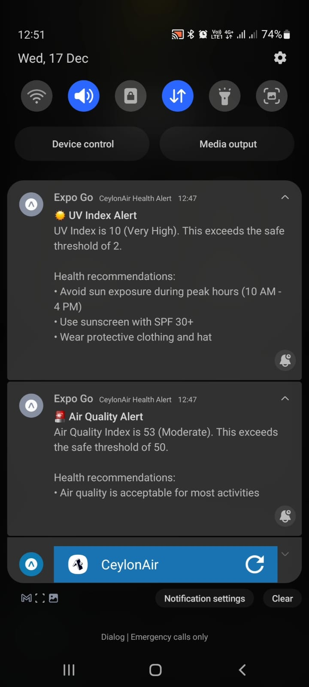

# CeylonAir Mobile App - User Manual

## Table of Contents

1. [Introduction](#introduction)
2. [Getting Started](#getting-started)
3. [Features Overview](#features-overview)
4. [Dashboard](#dashboard)
5. [Air Quality Map](#air-quality-map)
6. [Historical Data Charts](#historical-data-charts)
7. [Settings](#settings)
8. [Notifications](#notifications)
9. [Frequently Asked Questions](#frequently-asked-questions)

---

## Introduction

Welcome to **CeylonAir**, a comprehensive air quality and environmental monitoring application designed for Sri Lanka. This mobile app provides real-time air quality data, UV index information, and atmospheric metrics to help you make informed decisions about outdoor activities and health.

### Key Features

- 🌍 Real-time air quality monitoring
- 📍 Interactive map view of nearby monitoring stations
- 📊 Historical data charts and trends
- 🔔 Customizable notifications and alerts
- ⚙️ Personalized settings and preferences
- 🌙 Night mode support for comfortable viewing

---

## Getting Started

### Initial Setup

1. **Install and Launch**: Open the CeylonAir app on your mobile device
2. **Location Permission**: When prompted, grant location permissions to access your current location
   - This allows the app to show nearby air quality stations
   - You can change this permission in your device settings anytime

### Location Permission Screen

- The app requests permission to access your location
- This is essential for showing nearby stations and environmental data
- You can proceed with or without this permission

---

## Features Overview

CeylonAir provides four main sections:

1. **Dashboard** - Current environmental data overview
2. **Map View** - Interactive map of air quality stations
3. **Charts** - Historical data and trends
4. **Settings** - Customize your preferences

Use the bottom navigation to switch between sections.

---

## Dashboard

### Overview

The Dashboard provides a quick snapshot of current environmental conditions at your location.

### Dashboard Displays

#### Air Quality Index (AQI)

Shows the current air quality status:

- **Good (0-50)**: Green indicator - Safe for all outdoor activities
- **Moderate (51-100)**: Yellow indicator - Acceptable; unusually sensitive people should consider limiting outdoor exposure
- **Unhealthy for Sensitive Groups (101-150)**: Orange indicator - Sensitive groups should limit outdoor activities
- **Unhealthy (151-200)**: Red indicator - Everyone may experience health effects; limit outdoor exposure
- **Very Unhealthy (201-300)**: Purple indicator - Health alert; avoid outdoor activities
- **Hazardous (301+)**: Dark purple indicator - Health warning; stay indoors

#### UV Index

Indicates the strength of ultraviolet radiation:

- **Low (0-2)**: Minimal sun protection required
- **Moderate (3-5)**: Wear sunscreen and protective clothing
- **High (6-7)**: Extra protection needed; limit midday sun exposure
- **Very High (8-10)**: Minimize sun exposure; use maximum protection
- **Extreme (11+)**: Avoid sun exposure; stay indoors if possible

#### Atmospheric Score

A composite score reflecting overall atmospheric conditions including:

- Humidity levels
- Temperature
- Pressure
- Wind conditions

### How to Use the Dashboard

1. Launch the app to view the Dashboard automatically
2. Scroll down to see all available metrics
3. Each metric shows:
   - Current value
   - Category/Status
   - Visual indicators (color-coded)
4. Tap any metric for more detailed information
5. Use the refresh button to update data manually

---

## Air Quality Map

### Overview

The Map View displays all nearby air quality monitoring stations within a 20km radius of your location.

### Map Features

#### Station Markers

Different colored markers indicate air quality levels:

- **Green Markers**: Good air quality (AQI 0-50)
- **Yellow Markers**: Moderate air quality (AQI 51-100)
- **Orange Markers**: Unhealthy for sensitive groups (AQI 101-150)
- **Red Markers**: Unhealthy air quality (AQI 151-200)
- **Purple Markers**: Hazardous air quality (AQI 201+)

#### Coverage Area

- **Blue Circle**: Shows 20km radius coverage area around your location
- Stations within this circle are monitored and displayed

### How to Use the Map

1. Navigate to the **Map** tab
2. **View Stations**: All nearby stations appear as colored markers
3. **Tap a Marker**: Select any station to view:
   - Station name
   - Current AQI value
   - AQI category
   - Distance from your location
4. **Pan and Zoom**: Use two-finger gestures to zoom and explore the map
5. **Current Location**: Your position is shown with a location indicator
6. **Night Mode**: The map automatically adjusts colors for nighttime viewing (6 PM - 6 AM)

### Legend

The legend at the bottom of the screen explains color coding:

- Green (0-50): Good
- Yellow (51-100): Moderate
- Orange (101-150): Unhealthy for Sensitive Groups
- Red (151-200): Unhealthy
- Purple (200+): Very Unhealthy/Hazardous

---

## Historical Data Charts

### Overview

The Charts section displays historical trends of air quality data over different time periods.

### Available Periods

Select from three time ranges to view historical data:

- **6h** - Last 6 hours (hourly data points)
- **24h** - Last 24 hours (hourly data points) - Default view
- **7d** - Last 7 days (daily data points)

### Chart Types

#### 1. Air Quality Index (AQI) Trend

- **X-axis**: Time (hours or days depending on period)
- **Y-axis**: AQI values (0-500+)
- **Color**: Dynamic - follows AQI status colors
- **Shows**: How air quality has changed over the selected period

#### 2. UV Index Trend

- **X-axis**: Time (hours or days)
- **Y-axis**: UV Index values (0-14)
- **Color**: Dynamic - from safe (blue) to extreme (red)
- **Shows**: Ultraviolet radiation exposure patterns

#### 3. Atmospheric Score

- **X-axis**: Time (hours or days)
- **Y-axis**: Score values (0-100)
- **Color**: Green to red gradient
- **Shows**: Overall atmospheric conditions (humidity, temperature, pressure)

### How to Use Charts

1. Navigate to the **Charts** tab
2. **Select Time Period**: Tap 6h, 24h, or 7d buttons
3. **View Trends**: Charts automatically update to show selected period
4. **Data Points**: Hover over data points to see exact values
5. **Refresh Data**: Tap "Refresh Data" button to fetch latest information
6. **Auto-Update**: Data automatically updates based on your fetch interval setting

### Data Collection

- Data is automatically collected according to your fetch interval setting
- Minimum interval: 30 minutes
- Maximum interval: 24 hours
- Default interval: 1 hour
- All data is stored locally on your device
- Data older than 7 days is automatically removed

---

## Settings

### Overview

Customize your CeylonAir experience with personalized preferences.

### Settings Options

#### 1. Notification Thresholds

**Air Quality Index (AQI) Threshold**

- Set the AQI level that triggers alerts
- Default: 150 (Unhealthy level)
- When air quality exceeds this level, you'll receive a notification
- Range: 0-500

**UV Index Threshold**

- Set the UV level that triggers alerts
- Default: 8 (Very High)
- When UV index exceeds this level, you'll receive a notification
- Range: 0-14

#### 2. Notification Preferences

**Enable/Disable Notifications**

- Toggle notifications on or off
- When disabled, no alerts will be sent
- You can still view data manually in the app

**Test Notification**

- Send a test notification to verify your settings are working
- Useful for checking notification permissions

#### 3. Data Fetch Interval

Set how frequently the app should fetch new data:

**Available Intervals**:

- 30 minutes (most frequent - uses more battery)
- 1 hour (recommended)
- 2 hours
- 6 hours
- 12 hours
- 24 hours (least frequent - saves battery)

**How It Works**:

- App fetches data from APIs at your chosen interval
- Data is stored locally using AsyncStorage
- Charts are automatically populated with new data
- Notifications are sent if thresholds are exceeded

### How to Use Settings

1. Navigate to the **Settings** tab
2. **Change AQI Threshold**:

   - Use the picker to select your preferred level
   - Tap "Save AQI Threshold"

3. **Change UV Threshold**:

   - Use the picker to select your preferred level
   - Tap "Save UV Threshold"

4. **Toggle Notifications**:

   - Tap the switch to enable/disable alerts

5. **Test Notifications**:

   - Tap "Test Notification" to verify settings

6. **Set Fetch Interval**:
   - Choose your preferred update frequency
   - Tap "Save Fetch Interval"

---

## Notifications

### Alert System

When environmental conditions exceed your set thresholds, you'll receive notifications.

### Types of Alerts

#### Air Quality Alerts

- Triggered when AQI exceeds your threshold
- Includes current AQI value and category
- Recommends actions based on severity

#### UV Index Alerts

- Triggered when UV index exceeds your threshold
- Advises on sun protection measures
- Provides UV category information

### Managing Notifications

**To Enable Notifications**:

1. Go to Settings
2. Toggle "Enable Notifications" ON
3. Grant app notification permissions when prompted

**To Disable Notifications**:

1. Go to Settings
2. Toggle "Enable Notifications" OFF

**To Adjust Alert Thresholds**:

1. Go to Settings
2. Change AQI or UV thresholds
3. Save changes

**To Review Notification History**:

- Check your device's notification center
- Swipe down on Android or up on iOS to view notification log

### Notification Permissions

For notifications to work:

- Grant the app notification permissions
- Keep notifications enabled in app settings
- Ensure your device notifications are not silenced

---

## Frequently Asked Questions

### Q: Why does the app need location permission?

**A:** Location permission allows the app to:

- Show nearby air quality monitoring stations
- Display data relevant to your area
- Track environmental conditions around you
- You can deny this and manually select a location if preferred

### Q: How often is data updated?

**A:** Data updates according to your fetch interval setting:

- Default: Every hour
- Customizable from 30 minutes to 24 hours
- Background fetching works even when app is closed (on supported devices)
- You can manually refresh data anytime

### Q: Why aren't my charts showing data?

**A:**

1. Check that data fetch interval is set appropriately
2. Wait for at least one data fetch cycle
3. Manually tap "Refresh Data" in Charts section
4. Ensure you have internet connectivity
5. Check if notifications are enabled (they may be blocking data)

### Q: Can I use the app without location services?

**A:**

- Yes, you can use the app by allowing it to use Colombo's default location
- You'll see air quality data for the default location
- You can change this in Settings

### Q: How much storage space does the app use?

**A:**

- Historical data is stored locally using AsyncStorage
- 7 days of hourly data uses minimal storage (< 1 MB)
- Data older than 7 days is automatically deleted
- App itself is approximately 50-100 MB

### Q: What do the different AQI categories mean?

**A:**

- **Good**: No health concerns; outdoor activities are safe
- **Moderate**: Sensitive groups should limit exposure
- **Unhealthy for Sensitive Groups**: Sensitive individuals should avoid outdoor activities
- **Unhealthy**: General public may experience health effects
- **Very Unhealthy**: Everyone may experience serious health effects
- **Hazardous**: Health alert; stay indoors

### Q: Can I export my data?

**A:**

- Data is stored locally on your device
- You can view all data in the Charts section
- Consider taking screenshots for personal records
- Data is retained for 7 days then automatically deleted

### Q: How do I know if I'm getting accurate data?

**A:**

- The app uses IQAir API for AQI data
- Data comes from certified monitoring stations
- Multiple stations are shown on the map for comparison
- You can verify data from official environmental agencies

### Q: Does the app work offline?

**A:**

- Limited functionality offline
- You can view previously cached data
- New data requires internet connection
- Real-time API calls require active internet

### Q: How do I troubleshoot app issues?

**A:**

1. Force close and reopen the app
2. Check internet connectivity
3. Verify location permissions are granted
4. Check available storage space
5. Update to the latest app version
6. Uninstall and reinstall if issues persist

### Q: Can I customize the map view?

**A:**

- Map automatically adjusts for day/night mode
- Zoom and pan to explore different areas
- Tap markers to see station details
- Circle shows 20km coverage radius

### Q: How do thresholds work?

**A:**

- When actual values exceed your threshold, you get notified
- Example: If you set AQI threshold to 100, you'll be alerted when AQI > 100
- Each threshold is independent (AQI and UV)
- You can set different thresholds for different sensitivities

---

## Tips and Tricks

### Battery Conservation

- Increase data fetch interval to 6-12 hours
- Disable notifications if you don't need real-time alerts
- Close the app when not in use

### Better Data Insights

- Set fetch interval to 1 hour for good balance
- Check charts regularly to identify trends
- Compare multiple stations on the map
- Use 7-day view to spot seasonal patterns

### Optimal Notification Setup

- Set thresholds based on your health conditions
- Test notifications to ensure they're working
- Review history regularly to identify patterns
- Adjust thresholds seasonally if needed

### Map Navigation

- Use zoom gestures to explore areas
- Tap multiple stations to compare values
- Note color patterns for quick reference
- Check coverage area (blue circle)

---

## Technical Information

### Supported Platforms

- iOS 12.0+
- Android 6.0+

### Requirements

- Location services (optional but recommended)
- Internet connection for data fetching
- 50-100 MB free storage space

### Data Sources

- **AQI Data**: IQAir API
- **UV Index**: Real-time monitoring APIs
- **Atmospheric Data**: Meteorological services

### Permissions Required

- Location access (optional)
- Notification permissions (for alerts)
- Storage access (for local caching)

---

## Feedback and Support

We'd love to hear from you!

- **Report Issues**: Contact our support team
- **Suggest Features**: Email your ideas
- **Send Feedback**: Help us improve the app

---

## Version History

**Current Version**: 1.0.0

### Latest Updates

- Initial release
- Real-time air quality monitoring
- Interactive map view
- Historical data charts
- Customizable notifications
- Night mode support

---

**Last Updated**: December 2024

For more information, visit the project repository or contact support.

---

**Disclaimer**: CeylonAir provides environmental monitoring data for informational purposes. Always consult official environmental agencies and health professionals for critical health decisions.
